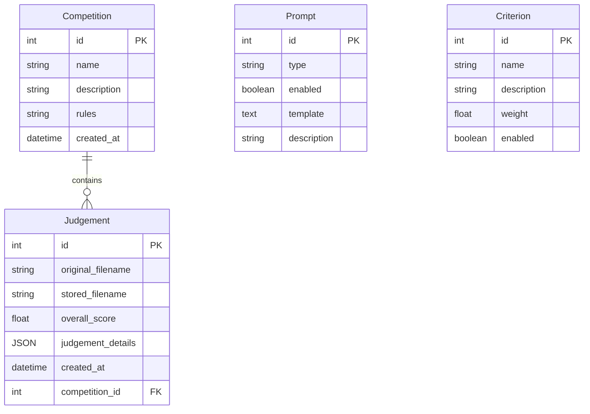

# 🤖 AI Photo Judge

An AI-powered workflow designed to judge photos for photography competitions, using a LangGraph-based agent to analyze and score images.

---

## 📸 About The Project

This application provides a system for helping photographers decide on photographs to select for entry to competitions. A FastAPI backend powers a LangGraph workflow that leverages a Gemini multimodal model to "see" and evaluate images. The results are stored in a simple SQLite database, with the images saved directly to the filesystem.

The frontend is a React + Vite application that provides a user interface for uploading photos and viewing the results.

### Showcase


---

### 🛠️ Tech Stack

* **Backend:**

  * Python 3.13
  * FastAPI
  * LangChain & LangGraph
  * Gemini (easily swappable with other model providers in LangChain)
  * SQLite
* **Frontend:**

  * React
  * Vite
  * Tailwind CSS

### ⚠️ Disclaimer

> The frontend was rapidly developed and is largely "vibe coded" with the assistance of AI. It serves as a functional proof-of-concept for the backend workflow.

---

## 🚀 Getting Started

Follow these instructions to get a copy of the project up and running on your local machine for development and testing purposes.

### ✅ Prerequisites

Before you begin, ensure you have the following installed:

* **Node.js and npm:** Required for the frontend. You can download it from [nodejs.org](https://nodejs.org/).
* **Python (preferably 3.13):** Required for the backend.
* **uv:** A fast Python package installer and resolver. If you don't have it, you can install it by following the instructions on their website:

  * [**Install `uv` Package Manager**](https://github.com/astral-sh/uv)

### ⚙️ Installation

1. **Clone the repository:**

   ```sh
   git clone https://github.com/elmernik/photo-judge-app.git
   cd photo-judge-app
   ```

2. **Backend Setup:**

   * Navigate to the `backend` directory:

     ```sh
     cd backend
     ```
   * Create and activate a virtual environment using `uv`:

     ```sh
     uv venv
     source .venv/bin/activate
     ```
   * Install the required Python packages:

     ```sh
     uv sync
     ```

3. **Frontend Setup:**

   * Navigate to the `frontend` directory from the project root:

     ```sh
     cd ../frontend # or cd frontend from root
     ```
   * Install the necessary npm packages:

     ```sh
     npm install
     ```
   * Create a `.env` file in the `frontend` directory. Add your Google Gemini API key to it:

     ```env
     GOOGLE_API_KEY=your_gemini_api_key_here
     ```

### ▶️ Running the Application

1. **Return to the root directory** of the project.
2. **Run the development server** for both frontend and backend concurrently:

   ```sh
   make dev
   ```

This will start the application. Open your browser and navigate to `http://localhost:5173` to see it in action.

---

## 📚 How to Use the App

### 🏆 Competitions

* Judgements are organized by **competitions**, each with its own set of rules or descriptions for how entries should be evaluated.
* You can **create** multiple competitions; each competition defines its own context and judging guidelines.

### ⚖️ Criteria

* **Criteria** are managed **globally** across all competitions.
* You may create any number of criteria (e.g., composition, exposure, creativity).
* Each criterion has an **enabled** flag; only enabled criteria are applied when analyzing photos.
* The **overall score** for a photo in a given competition is calculated as the **weighted average** of the scores assigned for each enabled criterion.

### 💬 Prompts

* The system supports multiple **prompts** per prompt type (e.g., different wording for the same evaluation question).
* You may create and manage prompts globally.
* For each prompt type, you can only have one prompt **enabled** at a time; the enabled prompt is used during analysis.

---

## 🗂️ Data Model

Below is a high-level Entity-Relationship diagram of the primary tables in the SQLite database (as defined in `app/models.py`):


